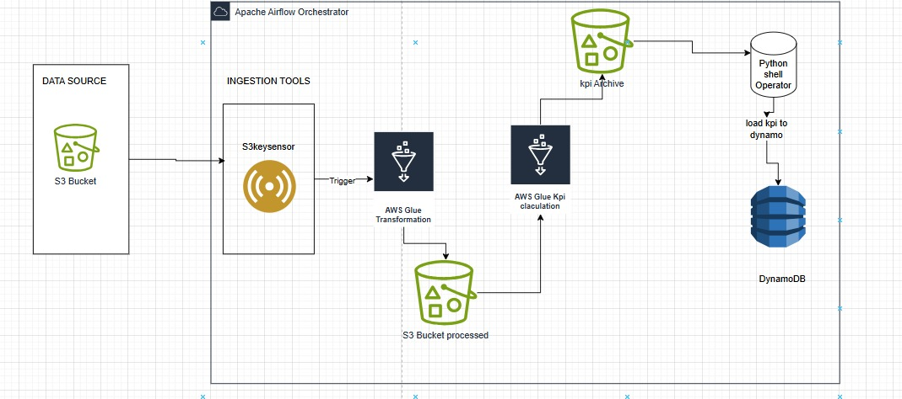

#  Real-Time Music Streaming KPI Pipeline (AWS Glue + MWAA)

This project implements an **automated real-time ETL pipeline** for a music streaming service. It transforms raw stream data from Amazon S3 into actionable KPIs and loads them into DynamoDB, orchestrated by **Apache Airflow (MWAA)** and triggered by **S3 + SQS** events.

<p align="center">
  
</p>

---

##  Project Overview

A music platform requires fast and reliable insights into user listening behavior. This pipeline:

* Ingests raw CSV data from S3 (users, songs, streams)
* Cleans, validates, and joins them in AWS Glue (PySpark)
* Computes daily KPIs (like top genres, total listening time)
* Loads the results into DynamoDB
* Uses Airflow (MWAA) to orchestrate the workflow based on file arrivals

---

##  Technologies Used

| Component     | Service/Tech                 |
| ------------- | ---------------------------- |
| Storage       | Amazon S3                    |
| Processing    | AWS Glue (Spark + Python)    |
| Orchestration | Apache Airflow on MWAA       |
| Trigger       | Amazon SQS (S3 event-driven) |
| Output Store  | Amazon DynamoDB              |

---

##  Architecture Summary

1. **S3 Raw Zone**: `users.csv`, `songs.csv`, `streams.csv`
2. **S3 Validated Zone**: cleaned parquet files
3. **S3 Bad Records**: invalid rows
4. **S3 Processed KPI**: computed KPI parquet files
5. **DynamoDB**: 3 tables for genre KPIs, top songs, and top genres
6. **Glue**: PySpark jobs for validation, transformation, KPI computation, and loading
7. **MWAA**: Triggers Glue jobs on S3 file arrival (via SQS)

---

##  User Stories

* As a **Data Engineer**, I want to:

  * Ingest new data automatically when it arrives
  * Validate and clean it with PySpark
  * Store insights efficiently in DynamoDB
  * Automate the full process using Airflow

* As a **Business Analyst**, I want to:

  * Query fast daily metrics from DynamoDB
  * Monitor listening patterns by genre and song

---

##  Data Schemas

### USERS

| Column        | Type      | Description       |
| ------------- | --------- | ----------------- |
| user\_id      | string    | Unique user ID    |
| user\_name    | string    | Name              |
| user\_age     | integer   | Age               |
| user\_country | string    | Country           |
| created\_at   | timestamp | Registration time |

### SONGS

| Column          | Type    | Description       |
| --------------- | ------- | ----------------- |
| track\_id       | string  | Song ID           |
| track\_name     | string  | Name              |
| artists         | string  | Performer(s)      |
| album\_name     | string  | Album             |
| track\_genre    | string  | Genre             |
| duration\_ms    | integer | Duration in ms    |
| danceability... | float   | Audio features... |

### STREAMS

| Column       | Type      | Description        |
| ------------ | --------- | ------------------ |
| user\_id     | string    | Who listened       |
| track\_id    | string    | What was listened  |
| listen\_time | timestamp | When they listened |

---

##  KPIs Computed

* **Listen Count** per genre per day
* **Unique Listeners** per genre per day
* **Total Listening Time** (ms)
* **Average Listening Time/User**
* **Top 3 Songs per Genre per Day**
* **Top 5 Genres per Day**

---

##  DynamoDB Tables

### genre\_kpis\_table

* **PK**: date (String)
* **SK**: track\_genre (String)
* listen\_count, unique\_listeners, etc.

### top\_songs\_table

* **PK**: date
* **SK**: track\_id
* track\_name, genre, rank

### top\_genres\_table

* **PK**: date
* **SK**: track\_genre
* genre\_listens, rank

---

## 🚀 Pipeline Execution Flow

```text
START
  └➜ wait_for_stream_event (SqsSensor)
        └➜ data_validation (GlueJob)
             └➜ if FAILED ➞ validation_failed ➞ END
             └➜ compute_kpis (GlueJob)
                  └➜ load_to_dynamo (GlueJob) ➞ END
```

### Conditional Routing

* If validation fails: DAG ends cleanly with `TriggerRule`
* If validation passes: DAG continues to compute and load KPIs

---

##  Setup Guide (Short)

1. **Upload CSVs** to S3 under `/raw-data/`
2. **Create Glue Catalog** and crawlers for all 3 datasets
3. **Deploy Glue Jobs**:

   * Job 1: Validate + clean + join
   * Job 2: Compute KPIs
   * Job 3: Load to Dynamo
4. **Create DynamoDB Tables**
5. **Deploy DAG** to MWAA and connect with SQS queue
6. **Create S3 → SQS event trigger**
7. **Test**: Upload new data to S3 and observe full flow

---

##  Folder Structure

```bash
.
├── glue-scripts/
│   ├─ data_validation_job.py
│   ├─ kpi_computation_job.py
│   └─ load_to_dynamo.py
├── dags/
│   └─ music_stream_kpi_pipeline.py
├── images/
│   └─ architecture.jpeg
└── README.md
```

---

##  Future Work

* Add archive logic for processed files
* Add Slack or SNS failure alerts
* Add watermark or deduplication logic
* Build dashboards from DynamoDB with QuickSight or Streamlit

---

##  Author

**Richard Amasah**  
Data Engineer

